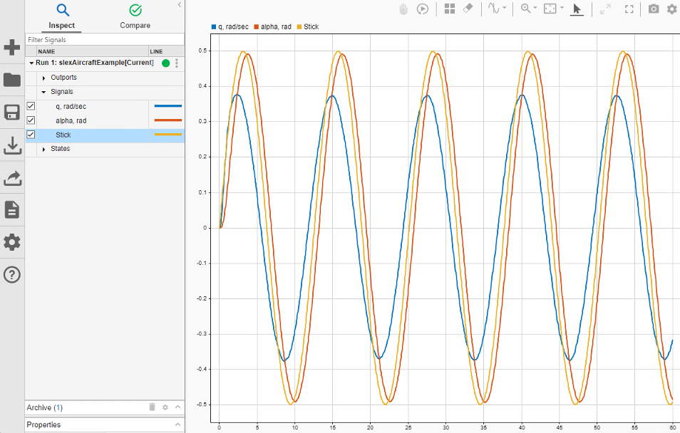
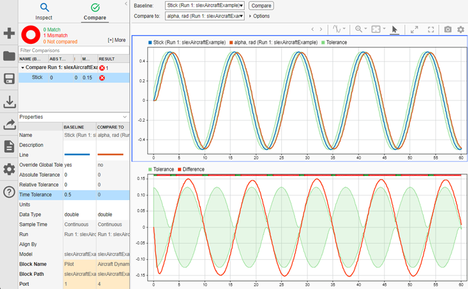

# Simulation & Mission-Analysis Reference Study (`simulation-study.md`)

Lane: 2 of 5 independent research lanes (brief `docs/design-research/brief.md`). Owner: DeepSeek V4 Flash. All evidence local under `evidence/simulation/`. Report ID prefix: **SIM**.

---

## 1. Scope and method

**Assignment.** Screen 4 products — Ansys STK, Ansys Mechanical/Workbench, MathWorks Simulink Simulation Data Inspector (SDI), Siemens Simcenter STAR-CCM+ — deep-study STK and SDI (≥3 complete workflow analyses across 2+ deep products), include Mechanical stale-results behavior, ≥2 genuinely observed UI examples with annotations, ≥1 independent practitioner/training signal or documented bounded search failure. Focus: scenario/time/context, configure-run-inspect, comparison baseline/alignment/tolerance, provenance/invalidation, failure recovery, density and controls.

**Model/method.** This study was authored by the **DeepSeek V4 Flash (openrouter/deepseek/deepseek-v4-flash-0731)** worker per the brief's bulk-research selection. Methods used, in order of evidentiary weight:

1. **Official documentation reading** — primary sources only (help.agi.com STK 12.7.1, mathworks.com current Simulink/SDI help, ansyshelp.ansys.com Mechanical/Workbench 2025 R1 v251 docs). Read via native HTML extraction; exact quotes recorded in evidence items.
2. **Observed-screenshot verification** — official-doc product screenshots downloaded locally, then described by a vision model to independently confirm what each image actually shows before citing it (`method: observed screenshot`). No hand-eye interaction with the products: no valid STK/SD/STAR-CCM+ license, no running product binaries were available on this host (see §8, evidence SIM-EVID-015).
3. **Bounded practitioner search** — web search for training/community discussion; primary thread content read directly where readable; login-gated sources documented as bounded search failures (§7) rather than invented.
4. **Orca embedded browser** — used to open and capture the primary STK help topic in an Orca-managed tab (new tab, screenshot saved, tab closed). Method artifact: SIM-EVID-012. No other parties contacted; no accounts or purchases.

**Access window:** 2026-09-10. **Product versions studied:** STK 12.7.1 (docs edition), Simulink SDI current online help (R2024b+ era UI; pages reference "Before R2024b" differences), Ansys Mechanical/Workbench 2025 R1 (v25.1 docs), Simcenter STAR-CCM+ 2310 (Siemens blog, 2023-11).

**Honesty constraints applied:** NASA Systems Engineering Handbook references inside STK marketing are **not** counted as customer-adoption evidence (per brief). No claim in this study implies vendor validation of Astraea physics; where a UI pattern is credited we say so, and where a source is unverifiable we label it.

---

## 2. Screened candidates

| Product | Category | Intended user/task | Commercial positioning | Documented industrial relevance | Access level | Verdict / rationale |
|---|---|---|---|---|---|---|
| **Ansys STK 12.7.1** (AGI) | Mission analysis / astrodynamics | Mission designers, satellite operators; scenario = design reference mission (DRM) | Defense/aerospace standard; $10k+ licensing | Used for DRM/ConOps in aerospace programs; STK training itself cites NASA Systems Engineering Handbook ch. 4 (marketing reference, not adoption evidence) | Docs public (help.agi.com); app requires license (not available here) | **Deep-study** — the richest publicly documented UI for exactly Astraea's domain (scenario/time context, access geometry, reports/graphs). SIM-EVID-001, -002, -003, -010, -011 |
| **MathWorks Simulink SDI** | Simulation data inspection/comparison | Control/systems engineers inspecting and comparing logged runs | Ubiquitous with MATLAB/Simulink; free with Simulink | Standard inspection tool in MATLAB-based design; docs describe R2024b+ UI | Docs fully public; app requires MATLAB license (not available here) | **Deep-study** — best-documented comparison semantics (alignment, sync, interpolation, tolerance bands) of the four. SIM-EVID-004..-009 |
| **Ansys Mechanical 2025 R1** (+ Workbench) | Structural FE analysis | Structural engineers; solver + postprocessing in Workbench project schematic | Enterprise engineering standard | Wide structural-industry use; not aerospace-mission specific | Docs public (ansyshelp.ansys.com); installed local copy is stub directories only (no runnable binary) — SIM-EVID-015 | **Deep-study limited to invalidation/provenance** — the *stale-results* behavior (auto-delete of results on geometry/mesh change, restart-point replayability matrix) is exactly the provenance/invalidation requirement. SIM-EVID-013 |
| **Siemens Simcenter STAR-CCM+ 2310** | CFD | CFD engineers; wizard-free single-platform pre/solve/post | Commercial CFD leader; simulation-tree driven | Automotive/aerospace CFD practice; Siemens blog describes Stages/automation | Official user guide license/portal-gated (bounded failure, §7); only vendor blog + third-party practitioner blog readable | **Screen only (deprioritize for UI borrowing)** — staged-tree + automation ideas are conceptually interesting but no inspectable official UI examples; can't meet the observed-UI bar here. SIM-EVID-014, -016 |

Screened 4 candidates per lane; **2 deep-studied** (STK, SDI) plus a third deep-study on *Mechanical invalidation semantics* (not full UI tour). 4 complete workflow analyses delivered in §3–§5 (≥3 required).

---

## 3. Deep workflow 1 — STK: scenario build and workspace orientation (deep product 1/2)

Source: STK 12.7.1 Level 1 training, "Build Scenarios" — `help.agi.com/stk/12.7.1/Content/training/L1_BuildScenarios.htm` (SIM-EVID-001). Method: official documented. No product hands-on.

**Task + starting state.** New user, empty STK. Goal: stand up a scenario (STK's core container = a *design reference mission* in their words), orient in the workspace, and animate time.

**Step-by-step (documented actions → resulting visible states):**

1. **Central body choice (context first).** View → *Planetary Options* enables a *Central Body:* drop-down on the New Scenario dialog (Earth default). → Confirms the **context object's root parameter is exposed at creation time**.
2. **New Scenario Wizard.** Create Scenario → fields *Name* (creates a same-named directory), *Description* (becomes long description in Open dialog), *Start* / *Stop* (defaults = "today at your local midnight converted to UTCG/ZULU"; epoch auto-set to start; preset shortcuts: Today, Tomorrow, calendar, unit/format switching). → **Time context is set once at creation and inherited by every object.**
3. **Save.** Scenario directory `C:\...\Documents\STK 12\<ScenarioName>` — the folder *is* the scenario (files colocated). Instructed "save often".
4. **Object Browser.** Inserted objects appear in parent-child tree under the scenario (SIM-EVID-002 documents object inheritance semantics: scenario defines context, per-object overrides allowed).
5. **2D/3D Graphics windows.** Integrated workspace; Window → Tile Vertically. 2D = whole central body at a glance, day/night terminator visible; 3D = contextual globe. Toolbars per window: Grab Globe, Zoom In (drag-box), Zoom Out (zoom-stack aware — wheel zoom doesn't enter the stack), Snap Frame (bitmap export), Measure (distance+azimuth into status bar).
6. **Animation toolbar.** Start/Pause/Step Forward/Step Backward/Reverse/speed (default **10 s step**) + three clock modes: Normal (scenario time), Real-Time, X Real-Time (e.g., `1` = real time, >1 faster, <1 slower). Reset returns to start time without resetting speed. → **Playback speed and time step are twice-coupled (speed buttons also resize step forward/backward).**
7. **Timeline View.** Three timelines + time components; gray pointer scrubs animation time; 2D shading moves with time. (Actual UI: SIM-EVID-010.)

**Selection/context model.** Object selection happens in Object Browser; item context menus provide Zoom To / Properties everywhere. Properties Browser is modal-ish with Apply (keep open) vs OK (accept+close). Report selection is object-typed (see workflow 2).

**Error/cancel/recovery.** No recovery UX beyond documented memory-fault workarounds (report generation, see §4 step 5) and "if lost in view, Home View" / Reset. Tutorial warns exact distances require reports, not the Measure tool (accuracy signaling in-UI).

**Visual hierarchy/density.** Dense: multiple dockable windows simultaneously (Object Browser + 2D + 3D + Timeline + Messages + toolbars), each with its own toolbar strip; many icon-only toolbars (2D Defaults, 3D Defaults, 3D, 2D, Animation, Data Providers, Reporting). STK's answer to density is *docking/tabbing + per-window toolbars + right-click everywhere*, not consolidation.

**Source vs interpretation.** Documented facts: wizard fields, 10 s default step, timeline rows, measure→status bar. Interpretation (labeled): that object browser + per-window toolbars is the density strategy — that's design reading of the same documented screens, not vendor claim.

**Astraea adaptation.** Mission-level *time context defined once at project creation* (epoch, analysis start/stop, display timezone) inherited by vehicles and flights with per-object override; save = whole-project directory with colocated artifacts. Playback toolbar with explicit step size and a three-mode clock. Timeline strip showing component intervals (from §4) as a first-class view.

**Acceptance criterion.** In a new Astraea project, create a mission with an epoch + analysis window; every imported vehicle inherits the window unless overridden; a timeline view lists intervals per vehicle.

**What NOT to copy.** The modal New Scenario *wizard* for every new project; icon-only toolbar sprawl; wizard's requirement to choose central body before seeing anything.

**Unresolved.** Whether current STK versions auto-refresh open reports on scenario edits (12.7 docs still describe manual F5 refresh — see §4 step 5).

---

## 4. Deep workflow 2 — STK: access computation and report/graph generation (deep product 1/2)

Source: STK 12.7.1 Level 1 training, "Access Reports and Graphs" — `.../training/L1_AccessReports.htm` (SIM-EVID-003) and STK help "Generating Reports and Graphs" `.../stk/report.htm` (SIM-EVID-002). Method: official documented.

**Task + starting state.** Scenario `AccessReportsGraphs` with a ground facility (Castle Rock Teleport), a conical sensor (half-angle 90°, 1000 km max range), and three operational CUBESATs from the standard object database.

**Step-by-step:**

1. **Insert from standard database.** Facility via Search Standard Object Data (INTELSAT network) → sensor Insert Default, child of facility → satellites by search ("cubesat", filter "Operational Status"). Terrain server disable → facility sits on WGS84 ellipsoid (with terrain enabled geometry references terrain; toggling exposes the position-source distinction — **a data-provenance story inside the geometry step**).
2. **Constraints define validity.** Facility Basic-Constraints: Line of Sight enabled by default. Sensor Constraints-Basic: *Max: 1000 km* range. → Access validity = constraint set, not raw geometry.
3. **Access Tool compute.** Select "Access for" object (CR_FOV sensor, tree shows `Castle_Rock_Teleport-CR_FOV`), multi-select associated satellites, Compute. Result state: satellite rows change bold + asterisk, access key icon appears. 2D shows static highlight; 3D draws live line during animation.
4. **Access report/AER report.** Reports frame → Access… → access-time table (No Access Found if none); AER… reports azimuth/elevation/range with documented frame semantics (Az 0 = true north; range = center-to-center). Graph shows access intervals; **zoom-in auto-enabled on graph generation**; a text hover shows access start time.
5. **Report unit/report mutation semantics.** After changing range 1000→1500 km, the open access report shows **old data**: user must click **Refresh (F5)** to re-evaluate. Units dialog can re-skin any report dimension (sec→min). → **Reports are snapshots with an explicit refresh affordance; on-screen staleness is made visible by the refresh toolbar button, not by an automatic badge.**
6. **Export vs live.** Save as .txt/.csv is a static snapshot — "any property changes to the objects won't be reflected in this report" (documented). **Quick Report** is the live alternative: saved inside STK, re-evaluates on open, can be pinned "Show on Load".
7. **Report ↔ animation coupling.** Right-click an access start time → Set Animation Time; or copy value into the Current Scenario Time field. → **Report rows are navigable back into simulation time.**
8. **Stored Views.** Save 3D camera state + animation time as named view ("Sat First Access") that jumps back on select. → **View = camera + time, shareable within scenario.**
9. **Report & Graph Manager (depth tool).** Object Type selector (e.g., Satellite) → object list → installed styles (locked padlock; Installed vs My Styles) → Generate. Styles = composition of *Data Providers → Groups → Elements* (e.g., Classical Elements → J2000 → Semi-major Axis (km)). Custom reports: duplicate locked style → edit Content (add/remove elements via filter "Cartesian", move arrows) → per-element Units override → rename ("My Classical Orbit Elements") → Generate. Editing a locked style directly creates the copy to My Styles with a warning dialog (tutorial: "Click OK after reading the warning").
10. **Dynamic displays / strip charts.** Generate As: Dynamic Display/Strip Chart — data updates during animation. 3D Graphics Data Display adds the custom report to the top-left corner of the 3D window with font-size control (actual UI: SIM-EVID-011). Strip charts can't be generated for multiple objects (limitation).

**Failure recovery (documented, report system):** "in certain situations… the STK application will terminate due to exceeding the system memory. This is typically when the time interval's step size is set to a very small value and the time interval is very long." Documented workarounds: reduce scenario period, increase step size, split the period into smaller ranges, increase reporting time step (SIM-EVID-002). → **Vendor documents a crash-shaped failure and its mitigation; the UI offers no built-in guardrail (no estimate/advisory before generation).**

**Selection/context model.** Object Type + multi-select with Ctrl (same type; dissimilar types allowed in Report & Graph Manager but not for strip charts). Time period per report: Use Object Time Period (object availability → else scenario interval), Use Advanced Times, or Specify Times (interval list/time array; default vs ephemeris time points).

**Visual hierarchy/density.** Report window = toolbar (Refresh/units/save-as-txt/csv/quick-report/export) + tabular data; Report & Graph Manager = three-column manager (object list | styles | content editor). Custom style Content page is a two-column transfer list (available data providers | report contents) — a classic but heavy transfer-list UI. Density high: hundreds of data providers; the *filter field* ("Type Cartesian") is the density mitigation.

**Astraea adaptation + testable acceptance criterion.** *Two report modes with honest freshness semantics:* (a) **snapshot export** (immutable text/CSV of a run's computed quantities) and (b) **live view** that re-evaluates on open, with the staleness state named in the UI. Acceptance: after editing a motor/thrust parameter, a previously generated snapshot report displays unchanged while a live report shows a visible "re-evaluated" marker and updated values. Report rows navigate back to the simulation timestamp ("jump to t"). Named camera+time views.

**What NOT to copy.** Manual F5 staleness (silent old data until user remembers refresh) — Mechanical's stronger auto-invalidation followed by an *explicit* usability decision (§5) is the better model for Astraea; the transfer-list style editor without live preview; requiring one dialog per object insertion.

**Unresolved.** Does STK mark reports stale in any newer release? Public 12.7.1 docs describe only the F5 pattern.

---

## 5. Deep workflow 3 — SDI: visual inspection of simulation runs (deep product 2/2)

Source: MathWorks Simulink "Inspect Simulation Data" — `mathworks.com/help/simulink/ug/visual-inspection-of-signal-data.html` (SIM-EVID-004), with "Compare Simulation Data" setup (SIM-EVID-005). Method: official documented; UI states additionally verified on real screenshots (SIM-EVID-006, -007).

**Task + starting state.** Model `slexAircraftExample` (aircraft longitudinal flight control), signals `q, rad/sec`, `Stick`, `alpha, rad` to be logged; SDI opened from the Simulink **Simulation tab → Data Inspector**.

**Step-by-step (documented actions → resulting visible states):**

1. **Mark signals for logging in the model canvas.** Select signal wires → **Log Signals** button → *logging badge* appears above each signal wire. (Badge doubles as a shortcut: clicking a logged badge plots that signal in SDI.)
2. **Simulate.** The run appears in SDI. **Inspect pane**: signal table lists all logged signals in rows, organized by run. Runs collapse/expand (`Run 1: slexAircraftExample[Current]`).
3. **Select signals → plot.** Checkboxes next to signals in the table plot them; selected-subplot outline is blue; table row highlight marks the chosen signal.
4. **Multiple subplots + archive.** Second simulation: **by default SDI moves the prior run into the Archive and transfers the view to the current run**. Drag the archived run back into the work area to overlay. Select a `2×1` layout, click the lower subplot, check that run's signals there. Signals drag between subplots.
5. **Zoom/pan model.** Four zoom modes (Adaptive Zoom in/out, Zoom in Time, Zoom in Y) + Pan + Fit-to-view (both/time/Y). **Adaptive zoom**: vertical drag → Y only; horizontal drag → t only; box drag → rectangle; wheel → both axes. Double-click zoom, click-zoom fixed amount.
6. **Linked subplots.** Subplots linked in t by default: pan/zoom-in-time/fit-time/limit edits synchronize; unlink per-subplot (Visualization Settings → Limits → clear "Link plot"; broken-link glyph appears).
7. **Data cursors.** One or Two Cursors (toggle). Two cursors display three times (each cursor + span); span label draggable or type-ahead. Cursor time field accepts a typed timestamp; **asterisk on the label = interpolated value** (interpolation method from signal properties: zoh / linear / none). Arrow keys step sample-to-sample.
8. **Replay controls.** Replay sweeps a synchronous cursor across all subplots; default 1 s/s; speed editable; step forward/back sample-wise. **Documented: replay has no effect on any models or simulations** (safe scrubbing semantics).

**Selection/context model.** Run = context container (name, model, timestamp); signals nested under runs; selection = checkbox in table or badge in canvas; context-rich Properties pane (name, tolerance overrides, units, data type, sample time, alignment properties — see SIM-EVID-007 for the visible Properties fields).

**Error/cancel/recovery.** No failure scenarios documented for inspection itself; compare failure handling covered in §6 (Cancel button, incremental progress).

**Visual hierarchy/density (observed, SIM-EVID-006).** Left rail of concrete tools + **Inspect/Compare** first-class tab pair + Filter Signals table (NAME | LINE columns) + collapsible *Archive (N)* + Properties beneath; right = plot area with legend, toolbar row of ~14 icon controls, grid, both axes labeled; white background, colored traces. High but disciplined density: the table is the *index*, the plot is the *inspection surface*.

**Astraea adaptation + acceptance criterion.** Run archive with auto-promoted "[Current]" run; checkbox-to-layer signal table beside the plot with per-run grouping; adaptive zoom (axis-dependent drag semantics); typed-time cursor with **interpolated-value asterisk**; replay that is explicitly side-effect-free. Acceptance: run a simulation twice, first run auto-archives and a badge/flag shows which telemetry is interpolated at a chosen sample time.

**What NOT to copy.** Trace colors close in hue (vision inspection of SIM-EVID-006 found blue/orange-red/yellow traces distinguishable but low-contrast); low-visibility tiny status glyphs (compare icons are small — §6).

---

## 6. Deep workflow 4 — SDI: comparing runs/signals (deep product 2/2)

Sources: "Compare Simulation Data" (SIM-EVID-005) + "How the Simulation Data Inspector Compares Data" (SIM-EVID-004b). Method: official documented; verified against observed screenshots SIM-EVID-007/-008/-009.

**Task + starting state.** Two logged runs of `slexAircraftExample` (sine then square pilot waveform; later a third run with filter `Ts` 0.1→1 in Model Workspace — variable-step solver, so differing time vectors across runs).

**The four-stage compare pipeline (documented):**

1. **Align.** Pairs Baseline and Compare-To signals using Data Source, Path, SID, Signal Name properties in priority order (align preferences; **Align By / Then By...** chain). Unalignable signals are excluded and shown with a warning icon — "SDI does not compare signals that it cannot align."
2. **Synchronize.** `union` (interpolate sample points present in either signal; recommended: "more precise result") vs `intersection` (only common sample times; faster, "some data is discarded and precision lost").
3. **Interpolate.** Baseline's interpolation method (zoh / linear / none) applies to *both* signals; zoh/none replicate previous sample; linear uses neighbors (discrete→zoh, continuous→linear guidance).
4. **Tolerance + difference.** Non-double upcast to double; difference computed per point; compared against tolerance band. Result per signal: **match** / **mismatch** / **unaligned**.

**Tolerance band computation (exact, quoted):** tolerance = max(absTol, relTol×|baseline|) → band = baseline ± tolerance; with a time tolerance evaluated first over `[(t−tol),(t+tol)]` taking min/max points, then abs/rel applied to those extremes: `upper = max + max(absTol, relTol×max)`, `lower = min − max(absTol, relTol×min)`. "Most lenient" per-point interpretation. Global tolerances at the top of the Compare view apply to signals unless **Override Global Tol = yes** (setting global values does not mutate individual signal properties). **(Observed in SIM-EVID-007: Properties pane "Override Global Tole[–].. yes/no", Time Tolerance 0.5 vs 0, Absolute Tolerance rows.)**

**Interaction loop (observed workflow):**

1. Compare pane → Baseline (Signals or Runs) → Compare to → **Compare**.
2. Results summarized in a tree table: summary ring + counts (`0 Match / 14 Mismatch / 0 Not compared`, SIM-EVID-009), RESULT column per node, per-signal `ABS/REL/MAX D` columns (SIM-EVID-009 shows `q, rad/sec | 0 | 0 | 1.01`).
3. Select a signal → top plot = both signals, bottom = signed difference + tolerance band; green pass/red fail strip at top of the difference plot (SIM-EVID-007).
4. Add signal tolerance (e.g., time 0.5): editing the field **auto-runs the comparison on focus-out**; Override Global Tol flips to yes. Band redraws around baseline and difference plot.
5. Add absolute 0.05 → passes. → Tolerance authorship is iterative, immediate, and *visible in the plot simultaneously*.
6. **Out-of-tolerance navigation**: arrow buttons step through out-of-tolerance regions; two cursors bracket each region; keyboard arrows explore values inside.
7. **Constraints** (Options): Signal data types must match / start+stop times must match / time vectors must match; violation → mismatch computed *without numerical compare* (fast fail), plot area shows the explanation. Stop-on-first-mismatch modes (metadata, or data-driven) — unaligned signals and unit mismatches always stop.
8. **Cancel**: long comparisons show incremental progress summary; **Compare button mutates into Cancel** mid-run.

**Limitations (documented):** cannot compare `int64`/`uint64` or variable-size signals; "compares the signals on their overlapping interval" when intervals differ.

**Failure recovery.** Cancel + progress indicator; constraints give fast metadata-level failures instead of long numeric compares; stop-on-first-mismatch bounds wasted work.

**Astraea adaptation + acceptance criterion.** A *compare* mode as a sibling of *inspect* with explicit Baseline/Compare-To pickers; alignment by (source, path, name) with priority chain; synchronization union/intersection choice surfaced (recommend union); interpolation per signal; tolerance band = composite absolute/relative/time with the exact documented most-lenient math; tolerance editing re-runs on blur; green/red pass-fail strip + signed-difference subplot; **arrow-key navigation of out-of-tolerance regions**. Acceptance: two simulated Astraea runs differing in one parameter; the compare view shows band + strip + navigable OOT regions, and a renamed signal shows an *unaligned* state with explanation, not a wrong number.

**What NOT to copy.** Requirement to know the tolerance math to interpret results (a "why did this mismatch" explainer is the gap); small glyph-only status icons without text (observed in SIM-EVID-009).

---

## 7. Mechanical stale-results behavior (provenance/invalidation deep-study)

Sources: Mechanical User's Guide 2025 R1 §18.12 "Saving and Managing Results" and §18.6 "Using Solution Restarts" (SIM-EVID-013). Method: official documented.

**Stale results — explicit invalidation contract.** The primary finding, quoted: *"If you open a solved project and make a change to either the geometry or the mesh, Mechanical automatically deletes the content of the original project files (*.rst, *.out, etc.)."* Alongside it:

- Default solution output keeps only postprocessing files (`file.rst/.rth/.rmg/.psd/.mcom`, `ds.dat`, `solve.out`); unneeded solver files are deleted at end of solve (configurable).
- **Output Controls** restrict which result types go into `.rst` (strains off → smaller file).
- Re-solving a previously solved and saved database **backs up the saved result files automatically** in case the new solve is not saved. **Duplicate Without Results** reproduces the environment/model tree but not result data — explicit intent "loading changes are performed and the solution process is repeated".
- Restart model: restart points = solver state snapshots; **program-controlled** single restart point at last successful solve for nonlinear; **blue triangle = replayable** (exact-solution guarantee), **red = potentially non-replayable** (manual mode only); initial restart point is a placeholder (no disk file). Restart type Program Controlled always picks the last **replayable** point (conservative).
- Invalidation matrices (§18.6 tables): solver-controls changes (e.g., damping, solver units) → **all restart points deleted**; load-history changes → current point set to start of modified load step, non-replayable points may remain; boundary condition add/delete, model-level edits (Geometry, Contact Region, Joint, Mesh) → **invalidate and delete existing restart points** (exceptions: zero-magnitude Direct FE/Pressure). Units change mid-solve → solve **aborted with error**.
- Failure recovery: interrupting a solution preserves restart points from converged iterations; convergence failure always retains restart points; restarting lets the user tune analysis settings/load history and continue from prior progress; failed distributed solves can be recombined manually (COMBINE).

**Staleness UX reading.** Mechanical chooses **automatic, silent invalidation** (files deleted) vs STK's **manual F5 refresh**. Both are defensible; the risk niche is *silent* deletion (user discovers on post-processing). Astraea should adopt auto-invalidation *with relentless visibility*: any change to inputs that affects computed outputs marks affected results "stale" with the reason and a re-run affordance; keep old results only behind an explicit action (Mechanical's backup model). Acceptance: edit geometry in Astraea → the simulation result card shows a stale/needs-rerun state with reason and one-click re-run; pre-edit results remain inspectable only after an explicit "keep" decision.

**What NOT to copy.** Deleting result content without a notice or undo trail (Mechanical); keeping the user responsible for refresh (STK F5).

---

## 8. Genuinely observed UI examples (annotated)

All images local under `evidence/simulation/`; captured from official product documentation (MathWorks/AGI), verified by independent vision-model description of the actual downloaded pixels; attribution + locator in each item. Research use only; no republication permission assumed.

### Example A — SDI Inspect view. `sdi_plot_signals.png` (SIM-EVID-006)

Observed content (verified): left icon rail; **Inspect / Compare** tabs; *Filter Signals* table with columns `NAME | LINE`, rows `▼ Run 1: slexAircraftExample[Current]` → `Outputs` / `Signals` (checkboxes `q, rad/sec`, `alpha, rad`, `Stick`; `Stick` row selected/highlighted) / `States`; collapsible *Archive (1)* + *Properties* below; right plot with legend `■ q, rad/sec ■ alpha, rad ■ Stick`, three phase-shifted sine-like traces on white grid, x 0–60, y −0.5..0.5, plot toolbar of ~14 icon controls (hand/pan, play, grid, pencil, filter, magnifier, box-zoom, data cursor selected, autoscale, fullscreen, camera, gear).

Annotations: ① table-as-index (left) vs plot-as-surface (right) split; ② run header marks the current run; ③ per-signal checkbox layering; ④ plot toolbar density (icon-only); ⑤ archive bucket for prior runs (visible as collapsible `Archive (1)`).

### Example B — SDI Compare view with tolerance band. `sdi_compare_time_tolerance.png` (SIM-EVID-007)

Observed content (verified): Compare tab active with **0 Match / 1 Mismatch / 0 Not compared** summary and comparison tree (row `Stick` with red-X result); **Properties** two-column `BASELINE | COMPARE TO` table: Name `Stick (Run 1: ...)` vs `alpha, rad (Run 1: ...)`, Line blue/orange, **Override Global Tole..., Absolute Tolerance 0/0, Relative Tolerance 0/0, Time Tolerance 0.5/0**, Units, Data Type `double/double`, Sample Time `Continuous/Continuous`, Run, Model, Block Name/Path, Port `1/4`. Top plot: two near-overlapping sine waves (blue Stick baseline, orange alpha compare-to) with slight phase lag; bottom plot: green filled tolerance envelope + red signed-difference sine; red pass/fail strip along top of difference axes (regions where red exceeds green = OOT).

Annotations: ① baseline/compare-to selection pair at top; ② per-signal tolerance columns editing (delta 0.5 time tol) with auto re-compare on blur; ③ tolerance band = visual envelope, not a single number; ④ signed-difference subplot with pass/fail strip; ⑤ properties panel exposes the alignment/interpolation contract transparently; ⑥ status presented both numerically (counts) and graphically (band/strip).

### Example C — STK Timeline View with access intervals. `stk_timeline_view.jpg` (SIM-EVID-010)

Observed content: left object list rows (`AccessReportsGraphs_TEST AvailabilityIntervals`; `Facility-Castle_Rock_Teleport-Sensor-CR_FOV-To-Satellite-COMPASS_2_42777 AccessIntervals`, two CUBESAT access rows), right Gantt-style timeline with time ruler starting `01 Jun 2020 18:00:00`, orange availability bar (row 1) and gray access-interval bars, vertical gridlines; tutorial callouts label the terms `Accesses` / `Access Line`.

Annotation: ① availability vs access are **separate rows** (context vs derived interval); ② full object paths as row labels (partner naming); ③ bar-only encoding — start/stop times readable only against ruler; ④ time ruler shared with animation position.

### Example D — STK 3D dynamic data display. `stk_3d_data_display.jpg` (SIM-EVID-011)

Observed content: 3D globe view from LEO with satellite `CubesatXIV_28895` (gold box + panels), orbit track line, access line to `Castle_Rock_Teleport` (ground marker), and the **top-left overlay text** `CubesatXIV_28895 My Classical Orbit Elements: Time (UTCG) 1 Jun 2020 22:06:54.549, Semi-major Axis (m) 7054532.256, Eccentricity 0.002298, Inclination (deg) 97.904, RAAN (deg) 290.452, x/y/z (km) …`. `bing` attribution top-right.

Annotation: ① data display is **in-scene, positional, sizeable (font-size control), tied to animation time**; ② chosen units are rendered inline (`(m)`, `(km)`) — provenance visible in the value itself; ③ mixed precision display: 0.002298 vs 7054532.256 (display formatting is not normalized).

### Method artifact — Orca embedded browser capture. `emb_browser_stk_docs.png` (SIM-EVID-012)

The STK 12.7.1 help topic "Access Reports and Graphs" rendered in an Orca-managed browser tab (new tab created via `orca tab create`, captured via `orca screenshot`, tab closed). Confirms the embedded-browser reading path for this workspace's appliance; shows the help frame (licensing banner, training nav, content pane).

---

## 9. Practitioner / training signals

1. **SIM-EVID-008 (primary, quoted).** MATLAB Answers thread `2015611` "How to resolve 'Out of Tolerance' in the Simulation Data Inspector?" — asked 2023-08-31 (Jenny): comparing the *same TestCase between MATLAB 2019 and 2021*, "verified the comparison of 2 testcases has zero difference but the Max Diff Column … shows values of 0.9, 4, 9 … changed the global tolerance value to 0.1, 0.01, 1 but that did not make any difference." Answer (Suman, 2024-07-24): check alignment ("Any misalignment could cause … interpolation … differences even if the signals are identical"), check data types/precision, compare raw MAT data programmatically. Signal: **comparison results are treated with suspicion even by practitioners; tolerance-band semantics alone don't diagnose *why*; the UI's abstract difference numbers create false positives** — supports Astraea's need for an explainer layer and exact floating-point honesty (SDI upcasts to double; compare math above).
2. **STK training/community threads (Reddit `r/AerospaceEngineering`, 4+ threads via web-search summary; direct read blocked — see §7 bounded failures).** Recurring themes from the search summaries: basic scenario/orbit visualization is learnable, **advanced modules (Astrogator, sensor/comm) are a steep jump**; certifications valued as resume signal but "STK is just a tool — understand the fundamentals first"; license cost is a barrier for individuals. These are anecdote-level signals; the only content attributed here is what the search summaries actually returned (marked practitioner-reported, low strength).
3. **Volupe blog (Robin Victor, 2023-09-29, SIM-EVID-014).** Practitioner/trainer walkthrough of STAR-CCM+'s **Simulation Guide**: an embedded document in the simulation file whose hyperlinks point at simulation-tree nodes, "allow us to simplify the orientation within a simulation" and "reduce setup errors" in template files. Directly supports in-context documentation INSIDE the working surface.
4. **Siemens Simcenter blog (Annabella Grozescu, 2023-11-02, SIM-EVID-016).** Vendor blog introducing **Stages** (multiple physics setups in one simulation file) + Simulation Operations: automation targets explicitly named as "low productivity, **setups errors, inconsistency**"; staged-tree diff views to "quickly detect the differences between stages". Useful as *problem framing* (the UX ills are real) even though vendor-authored — not counted as independent adoption evidence.

---

## 10. Bounded search failures (documented, not invented)

- **STK community content (Reddit).** Direct reads of `r/AerospaceEngineering` STK threads (`dm26d5`, `wmsdx8`, `8fc0h9`, `q2m55v`, `1fjgzrv`) are login-gated (redirect to `old.reddit.com/login`); only aggregated search summaries usable. Thread-level quotes NOT fabricated; only summary-level themes referenced, labeled low strength.
- **Siemens community / official user guide.** The official STAR-CCM+ user guide and docs.sw.siemens.com are behind the Siemens support portal (account/entitlement). `community.sw.siemens.com` question page `0D5KZ000006pFuh0AE` returned a JS-loading shell ("Loading… / CSS Error") and no readable content. → STAR-CCM+ can't meet the observed-UI bar from here; screened with vendor/third-party blog evidence only.
- **STK app hands-on.** No STK license, and no `C:\Program Files\AGI` install on this host. All STK UI evidence is official-screenshot/documentation-sourced, not hands-on; factory-demo images (Bing-maps toggle, terrain server) are doc illustrations, treated as such.
- **Ansys local install.** `C:\Program Files\Ansys Inc\ANSYS Student\v252` holds directory structure (ACP, CFX, Fluent, Discovery, …) and `install.log` but no runnable Mechanical/Workbench binary (`bin`, `mechanical`, `commonfiles/launcher` absent; `ProductConfig.exe` present). No hands-on Mechanical run was possible; invalidation study is documentation-sourced (SIM-EVID-015).

---

## 11. Evidence index (`evidence/simulation/`)

| ID | Product/version | Source | Locator | Date | Method | Key observation | Local file |
|---|---|---|---|---|---|---|---|
| SIM-EVID-001 | STK 12.7.1 | help.agi.com …/training/L1_BuildScenarios.htm | §Setting up a new STK scenario; Animation toolbar; Timeline View | 2026-09-10 | official documented | Scenario = time/epoch context; wizard; 10 s default step; 2D/3D toolbars | — |
| SIM-EVID-002 | STK 12.7.1 | help.agi.com …/stk/report.htm; …/stk/ObjectMap_Scenario.htm | "Generating Reports and Graphs"; Scenario object map | 2026-09-10 | official documented | Report refresh/ownership; memory-fault workarounds; scenario context/override model | — |
| SIM-EVID-003 | STK 12.7.1 | help.agi.com …/training/L1_AccessReports.htm | full lesson | 2026-09-10 | official documented | Access compute → report/graph; F5 refresh; quick report live vs export static; data providers/groups/elements | — |
| SIM-EVID-004 | SDI (current help) | mathworks.com/help/simulink/ug/visual-inspection-of-signal-data.html | whole page | 2026-09-10 | official documented | Inspect flows; cursor interpolation asterisk | — |
| SIM-EVID-004b | SDI (current help) | mathworks.com/help/simulink/ug/how-the-simulation-data-inspector-tool-compares-time-series-data.html | whole page | 2026-09-10 | official documented | align/sync/interpolate/tolerance pipeline + exact band math | — |
| SIM-EVID-005 | SDI | mathworks.com/help/simulink/ug/compare-simulation-data.html | whole page | 2026-09-10 | official documented | Compare pane; constraints; cancel; global vs signal tolerance | — |
| SIM-EVID-006 | SDI R2024b+ | mathworks.com …/ug/sdi_slexaircraftexample_plot_signals.png | "A single run of signal data…" | 2026-09-10 | observed screenshot (vision-verified) | Inspect view: table+plot split, run header, checkboxes, toolbar | `sdi_plot_signals.png` |
| SIM-EVID-007 | SDI R2024b+ | mathworks.com …/ug/sdi_compare_signals_time_tolerance.png | "after applying a time tolerance" | 2026-09-10 | observed screenshot (vision-verified) | Compare view: band + difference + pass/fail strip + Properties baseline/compare columns | `sdi_compare_time_tolerance.png` |
| SIM-EVID-008 | SDI R2024b+ | mathworks.com …/ug/sdi_compare_runs.png + MATLAB Answers 2015611 | "Comparison results summary"; thread Q/A | 2026-09-10 | observed screenshot + practitioner reported | Run-compare tree (0/14/0 summary, ABS/REL/MAX D); practitioner OOT false-positive report | `sdi_compare_runs.png` |
| SIM-EVID-009 | SDI R2024b+ | mathworks.com …/ug/sdi_compare_runs_plot.png | "Run comparison results … q, rad/sec" | 2026-09-10 | observed screenshot | Compare plots, difference banding | `sdi_compare_runs_plot.png` |
| SIM-EVID-010 | STK 12.7.1 | help.agi.com …/training/images/Timeline View.jpg | "Timeline View with Accesses" | 2026-09-10 | observed screenshot (vision-verified) | Timeline Gantt rows, availability vs access intervals | `stk_timeline_view.jpg` |
| SIM-EVID-011 | STK 12.7.1 | help.agi.com …/training/images/3d Data Display.jpg | "3D Graphics Window Dynamic Data" | 2026-09-10 | observed screenshot (vision-verified) | In-scene dynamic data display, units inline | `stk_3d_data_display.jpg` |
| SIM-EVID-012 | STK 12.7.1 | help.agi.com …/training/L1_AccessReports.htm via Orca embedded browser | tab capture | 2026-09-10 | observed screenshot (browser) | Help frame; embedded-browser method artifact | `emb_browser_stk_docs.png` |
| SIM-EVID-013 | Mechanical 2025 R1 | ansyshelp.ansys.com v251 wb_sim/ds_SolvRes_Saving.html; ds_solution_restarts.html | §18.12, §18.6 incl. invalidation tables | 2026-09-10 | official documented | Auto-delete of .rst/.out on geometry/mesh change; restart points replayable/non; invalidation matrix | — |
| SIM-EVID-014 | STAR-CCM+ 2310 | volupe.com/simcenter-star-ccm/simulation-guide-in-simcenter-starccm/ | whole article | 2026-09-10 | practitioner reported (3rd-party blog) | Simulation Guide embedded doc + tree-node hyperlinks reduce setup errors | — |
| SIM-EVID-015 | Ansys 2025 R2 (local) | `C:/Program Files/Ansys Inc` (+ ANSYS Student) | directory listing | 2026-09-10 | hands-on (local inspection) | No runnable Mechanical/Workbench binary; install stubs only → no app hands-on | — |
| SIM-EVID-016 | STAR-CCM+ 2310 | blogs.sw.siemens.com/simcenter/tackle-complex-cfd-workflows/ | whole article; Stages intro | 2026-09-10 | official documented (vendor blog) | Stages/Simulation Ops target "setups errors, inconsistency"; staged-tree diff views | — |

Supplementary local images (doc illustrations, cited where used): `sdi_two_cursors.png` (SIM-EVID-006 companion), `stk_3d_northamerica.jpg`, `stk_terrain_server.jpg`, `stk_access_lines.jpg`, `sdi_compare_runs_plot.png`. All downloaded 2026-09-10 with attribution in-text; research use only.

---

## 12. Adopt / adapt / reject matrix (for Astraea simulation UX)

| Pattern | Source evidence | Verdict | Astraea application |
|---|---|---|---|
| Mission/scenario as time+context container, per-object override | SIM-EVID-001/002 | **Adopt** | Project-level epoch/analysis window set at creation, inherited by vehicles, overridable |
| Timeline view with availability vs access rows | SIM-EVID-010 | **Adopt** | Interval strip per vehicle/pass over shared time ruler, linked to replay position |
| Inspect/Compare as first-class sibling panes | SIM-EVID-006/007 | **Adopt** | Run inspector + run comparison as tab pair, table-index + plot-surface |
| Run archive with current-run promotion | SIM-EVID-006 | **Adopt** | Keep N prior runs archived; "[Current]" badge; drag back to overlay |
| Checkbox signal layering table | SIM-EVID-006 | **Adopt** | Telemetry table with per-signal toggle beside plot |
| Adaptive axis-aware zoom; data cursor with interpolated-value asterisk | SIM-EVID-004/006 | **Adopt** | Same semantics; typed-time cursor into telemetry |
| Side-effect-free replay sweep | SIM-EVID-004 | **Adopt** | Replay across subplots, explicit "no model effect" cue |
| Four-stage compare pipeline (align→sync→interpolate→tol) with documented math | SIM-EVID-004b/005 | **Adopt** | Same pipeline; expose alignment and sync (default union) controls |
| Tolerance band envelope + signed difference + green/red strip + OOT navigation | SIM-EVID-007/008 | **Adopt** | Visual band + navigable OOT regions; arrow-key region stepping |
| Constraints fast-fail + stop-on-first-mismatch | SIM-EVID-005 | **Adopt** | Metadata constraints short-circuit long compares; explainer per signal |
| Auto-invalidate results on input change + backup old results on re-solve | SIM-EVID-013 | **Adopt** | Stale badge with reason + one-click re-run; explicit "keep old results" only |
| Restart points as replayable/non-replayable timeline markers | SIM-EVID-013 | **Adapt** | Mark simulation checkpoints/snapshots with replayability semantics and color legend |
| Snapshot export vs live quick-report duality | SIM-EVID-002/003 | **Adapt** | Export immutable; live views re-evaluate on open with visible freshness marker |
| Report→animation time jump | SIM-EVID-003 | **Adopt** | Click interval/row → seek simulation to timestamp |
| Stored named views (camera+time) | SIM-EVID-001/003 | **Adopt** | Named views capture camera + time |
| Manual F5 refresh staleness | SIM-EVID-003 | **Reject** | Silent old data; auto-invalidate instead (see above) |
| Silent automatic result-file deletion | SIM-EVID-013 | **Reject w/ note** | Adopt invalidation *only* with visible reason and no silent data destruction |
| New-Scenario modal wizard / icon toolbar sprawl / transfer-list report editor | SIM-EVID-001/003 | **Reject** | No modal wizard; consolidated contextual toolbars; live-preview list editor |
| STAR-CCM+ Stages/Simulation Ops per-se | SIM-EVID-014/016 | **Adapt (concept only)** | Multi-phase setup snapshots in one project worth a design spike; no UI evidence to copy |

---

## 13. Recommendation priorities for Astraea (highest-value transfers)

1. **Provenance as a first-class state.** STK's manual-F5 and Mechanical's silent-delete are the two poles; Astraea should implement auto-invalidation with *visible reasons* ("stale: geometry edited 14:02") and a one-click re-run — this is the single most portable lesson for a simulation product (covers brief mandate).
2. **Inspect/Compare pairing with a comparison contract users can audit.** The SDI pipeline (alignment properties, union/intersection sync, interpolation, composited abs/rel/time tolerance, band + strip + OOT navigation) is the best-documented comparison UX in the four products and maps directly onto telemetry-vs-baseline comparison in Astraea.
3. **Time context at creation, interval strip at inspection.** Scenario-epoch-first (STK) + availability-vs-access row model (Timeline View) gives a lightweight mission timeline above the plot.
4. **Table-index + plot-surface layout** with checkbox layering, archive, typed-time cursors with interpolation marks.

## 14. Unresolved questions

- STK: does any current release auto-stale open reports (12.7 docs still manual-F5)? What does STK 13/2025+ UI change? (Docs pinned to 12.7.1.)
- SDI: exact R2025/2026 layout diffs vs the R2024b-era pages used here (the "Before R2024b: click More" notes imply the pages track recent UI).
- Mechanical: invalidation observable only in docs here; a hands-on run (licensed) would confirm the auto-delete UX *behavior* (dialog? silent?).
- STAR-CCM+: Stages/staged-tree interaction detail (toolbar flag icon, diff views) is vendor-documented only; no observed UI available without a license.
- General: no claim of accessibility/performance compliance can be made from screenshots (per brief).